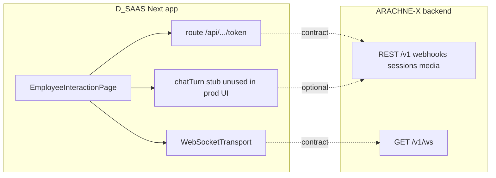

# ARACHNE-X ↔ D_SAAS (dashboard): контракт интеграции

**Сторона:** NULLXES  
**Аудитория:** прежде всего **команда фронта D_SAAS** (`dai_saas`, Next.js) и бэкенд ARACHNE-X; этот текст — точка согласования «что ждём на проводе», без привязки к документам JobAI.

**Где лежит файл в `dai_saas`:** [`documents/ARACHNE-X-dashboard-integration-contract.md`](./ARACHNE-X-dashboard-integration-contract.md) (папка [`documents/`](./README.md) — документация dashboard). Зеркальная копия для организации NULLXES может жить в **`Documentation/D_SAAS/`** (репозиторий ARACHNE-X). Материалы **JobAI pilot** — в том же монорепо NULLXES отдельно, путь вида `Documentation/JOBAI PILOT/` (в дереве **`dai_saas` этих файлов нет**).

**Назначение:** единая спека для стыковки **ARACHNE-X backend** (репозиторий ARACHNE-X) и **фронта D_SAAS** (`dai_saas`).  
**Источник типов на фронте:** `features/arachine-x/event-system/eventTypes.ts` (имя пакета с опечаткой `arachine-x`; переименование — отдельная задача).  
**Статус:** линия B реализована end-to-end: **ARACHNE-X** — `POST /v1/realtime/token`, `GET /v1/ws` (см. репо NULLXES, `Documentation/D_SAAS/`); **`dai_saas`** — mint, bootstrap, BFF `/api/arachine-x/token`, `WebSocketTransport`, UI на `EmployeeInteractionPage` (таблица ниже).

**Сопутствующие артефакты (репозиторий ARACHNE-X, не в `dai_saas`):** OpenAPI `GET /v1/openapi.json`, документ **NULLXES MVP Media Layer API** (`Documentation/JOBAI PILOT/NULLXES_MVP_Media_Layer_API_03-04-2026.md` — оркестрация слотов / webhook для **внешнего** platform-backend), `src/server/openapi_spec.py`.

**Канон по линии B (репо ARACHNE-X):** `Documentation/D_SAAS/ARACHNE_X_FRONTEND_CONTRACT.md`, `WIRE_EXAMPLES.md`, `TRUST_AND_ENV.md`, `DAI_SAAS_HANDOFF.md`, коллекция `Documentation/D_SAAS/bruno/`.

### Реализация в `dai_saas` (линия B, текущее состояние)

| Что | Где |
|-----|-----|
| Mint server→server | [`features/arachine-x/server/arachneRealtimeMint.server.ts`](../features/arachine-x/server/arachneRealtimeMint.server.ts) — `POST {ARACHNE_HTTP_BASE}/v1/realtime/token`, заголовок `X-NULLXES-Realtime-Service-Key` при заданном `NULLXES_REALTIME_SERVICE_KEY` |
| Bootstrap страницы сотрудника | [`getEmployeeSessionBootstrap`](../features/employees/service.server.ts): новый UUID `sessionId` на загрузку, опционально `nullxesSessionId` из query `?nullxesSessionId=` или `?nx=` |
| BFF токена (сессия пользователя) | [`app/api/arachine-x/token/route.ts`](../app/api/arachine-x/token/route.ts) — `runtime: nodejs`, `POST` с телом `sessionId` / `employeeId?` / `nullxesSessionId?`; `GET` только в non-production |
| WebSocket клиент | [`features/arachine-x/transport/WebSocketTransport.ts`](../features/arachine-x/transport/WebSocketTransport.ts) — `?token=` если не в URL; JSON кадры; закрытие `4401` / `1008` → `session.error` |
| Чат в UI | [`EmployeeInteractionPage`](../components/employee-interaction/EmployeeInteractionPage.tsx) — `chat.send` / приём `chat.message.received`; **без** `POST /v1/chat` в MVP |

Ответ mint на ARACHNE: `issuedAt` / `expiresAt` — строки ISO-8601 с `Z` (в типах [`AvatarTokenClaims`](../features/arachine-x/server/tokenClaims.server.ts)).

---

## 1. Две линии (не смешивать)

| Линия | Назначение | Где на фронте (ориентир) | Где на бэке (ARACHNE-X) |
|--------|------------|---------------------------|-------------------------|
| **A. Оркестрация сессий** | Webhook и lifecycle для **внешнего platform-backend** (HR / интервью / слоты); **не** то же самое, что открытие страницы сотрудника в dashboard | Обычно **не** в UI; вызывается сервером платформы | Реализовано: `POST /v1/webhooks/session`, `/v1/sessions/...`, `/v1/media/slots` — см. MVP Media Layer API и `GET /v1/openapi.json` в репо ARACHNE-X |
| **B. Dashboard realtime** | Токен, WebSocket, сигналы сессии/аватара/чата в браузере | `useAvatarRuntime`, `WebSocketTransport`, bootstrap в `EmployeeInteractionPage` | `POST /v1/realtime/token`, `GET /v1/ws` — см. OpenAPI и `Documentation/D_SAAS/*` в репо ARACHNE-X |

**MVP чата в UI:** **только WebSocket** (`chat.send` / `chat.message.received`). `chatTurn.ts` — локальная заглушка без `POST /v1/chat`; второй канал только по явному решению продукта.



---

## 2. Environments

| Окружение | Переменная / значение | Примечание |
|-----------|------------------------|------------|
| Dev | `NEXT_PUBLIC_ARACHNE_HTTP_BASE` (пример) | База HTTP API оркестратора (если фронт бьёт напрямую) |
| Dev | `NEXT_PUBLIC_ARACHNE_WS_URL` (пример) | Origin WebSocket **когда** сервер будет готов |
| Stage / Prod | Те же, с прод-оригинами | Рекомендуется **Next rewrite/proxy**: браузер бьёт в same-origin `/api/arachne/...` → upstream ARACHNE |

Плейсхолдеры имён env — согласовать в репозитории **`dai_saas`**; в этом репозитории примеры заданы в **`.env.example`** в корне проекта.

---

## 3. HTTP: выдача сессии и токена (совместимость с фронтом)

Фронт ожидает форму ответа в духе (заглушка `issueAvatarTokenClaims` / route token):

```json
{
  "token": "<string>",
  "websocketUrl": "wss://example.com/v1/realtime",
  "issuedAt": "2026-04-03T12:00:00.000Z",
  "expiresAt": "2026-04-03T12:15:00.000Z"
}
```

**Формат дат:** ARACHNE отдаёт `issuedAt` / `expiresAt` как **строки ISO-8601 с `Z`**. Тип [`AvatarTokenClaims`](../features/arachine-x/server/tokenClaims.server.ts) и ответ BFF используют те же строки без нормализации в числа.

**Рекомендации NULLXES для бэка (эволюция):**

- **Вариант 1 — JWT:** подпись (например HS256/RS256), claims минимум: `sub` (user), `employeeId`, `sessionId` или `roomId`, `capabilities` (массив строк), `aud` (например `arachne-realtime`), `iat`, `exp`. Срок жизни **короткий** (5–15 мин) для WS; обновление — повторный `POST` token или refresh flow (описать отдельно).
- **Вариант 2 — opaque token:** случайный id, сервер хранит сессию в Redis; в ответе тот же JSON, `token` не parseable на клиенте.

**Эндпоинт:** может оставаться на Next (`POST /api/arachine-x/token`), который **проксирует** или **подписывает** ответ, либо напрямую `POST https://arachne.../v1/token` — главное, чтобы **поля** совпадали с ожиданием UI.

---

## 4. Связь оркестратора NULLXES и `sessionId` в UI

Речь о **линии A** (webhook `POST /v1/webhooks/session`) и **линии B** (dashboard):

- **`nullxes_session_id`** в ответе webhook — идентификатор сессии **оркестратора** на ноде NULLXES (media slot, worker). Это контур **platform-backend**, не обязательно тот же поток, что открытие карточки сотрудника.
- **`sessionId` в dashboard** (`getEmployeeSessionBootstrap`) может быть:
  - **тот же**, если платформа создаёт сессию через NULLXES API и передаёт id в UI;
  - **отдельный** «комнатный» id, если UI-сессия создаётся при открытии страницы — тогда в токене нужны **оба** (например `nullxesSessionId` + `uiSessionId`) или явный маппинг на platform-backend.

Нужно явно выбрать модель продукта и отразить в claims токена. Значение **`sessionId`**, которое фронт кладёт в bootstrap, должно быть **согласовано** с полем `sessionId` в токене (§3) и, при использовании REST-чата, в теле запроса (§7).

---

## 5. WebSocket (целевой контракт)

**URL (пример):** `wss://api.example.com/v1/ws?token=<jwt_or_opaque>`  
**Альтернатива:** первый исходящий JSON-кадр от клиента после `onopen`:

```json
{ "type": "auth", "token": "<...>", "protocolVersion": 1 }
```

**Аутентификация:** предпочтительно **query `token`** или первый кадр `auth` (удобно в браузере). Заголовок `Authorization` на WS часто **не доступен** из JS — если прокси добавляет заголовок к upstream, это допустимо, но нужно документировать.

**Формат кадров (MVP сигналов):** **JSON text frames**, UTF-8, одно событие на кадр (можно расширить до NDJSON позже).

**Медиа (видео/аудио поток):** для production чаще **отдельный транспорт** (WebRTC, binary chunks с префиксом). В типах фронта уже есть `avatar.stream.chunk` с `seq` — на проводе для MVP допускается **только метаданные** без payload (`seq`, `kind`), а реальные кадры — в следующей версии протокола или параллельным каналом (**зафиксировать в `protocolVersion`**).

---

## 6. Таблица: провод ↔ `ArachineXEvent` / `ArachineXOutboundAction`

Имена полей на проводе **совпадают** с TypeScript-типами, если не оговорено иное.

### 6.1 Сервер → клиент (`ArachineXEvent`)

| `type` | Пример JSON |
|--------|-------------|
| `session.connecting` | `{"type":"session.connecting","at":1712140800123}` |
| `session.connected` | `{"type":"session.connected","at":1712140800456}` |
| `session.disconnected` | `{"type":"session.disconnected","at":1712140810000,"reason":"client_close"}` |
| `session.error` | `{"type":"session.error","at":1712140800999,"message":"auth_failed"}` |
| `avatar.state.changed` | `{"type":"avatar.state.changed","at":1712140801000,"state":"speaking"}` |
| `avatar.stream.chunk` | `{"type":"avatar.stream.chunk","at":1712140801100,"kind":"video","seq":42}` |
| `chat.message.received` | `{"type":"chat.message.received","at":1712140801200,"message":{"id":"msg_1","from":"assistant","text":"Здравствуйте."}}` |

`at` — Unix timestamp в миллисекундах (как `Date.now()` в JS).

### 6.2 Клиент → сервер (`ArachineXOutboundAction`)

| `type` | Пример JSON |
|--------|-------------|
| `chat.send` | `{"type":"chat.send","id":"client_uuid","text":"Привет"}` |
| `voice.mute` | `{"type":"voice.mute","muted":true}` |
| `session.disconnect` | `{"type":"session.disconnect"}` |

Сервер **игнорирует** неизвестные `type` с логом (MVP) или отвечает `session.error` — политику выбрать и не менять молча.

---

## 7. HTTP чат (опционально, если не в WS)

Если чат идёт только через REST:

- **Метод:** `POST /v1/chat` (префикс согласовать с OpenAPI).
- **Body (пример):**

```json
{
  "sessionId": "nx_...",
  "employeeId": "66",
  "messages": [{ "role": "user", "content": "..." }],
  "stream": false
}
```

- **Ответ:** либо полный JSON с текстом ассистента, либо **SSE** при `stream: true` (формат чанков зафиксировать: `data: {"delta":"..."}\n\n`).

Это заменяет заглушку в `features/arachne-x/chatTurn.ts` (подключение `fetch`).

---

## 8. Ошибки

| Контекст | Код / поведение |
|----------|------------------|
| HTTP token | `401` неверная сессия/пользователь; `403` нет прав на employee; `429` rate limit |
| HTTP chat | `400` валидация; `502` upstream LLM |
| WebSocket | Закрытие **код 4401** (или `1008` policy violation) при невалидном токене; тело причин до закрытия опционально дублировать событием `session.error` |
| Внутри WS | Всегда можно отправить `session.error` с `message` из машинно-читаемого набора (`auth_failed`, `session_expired`, `internal_error`) |

---

## 9. Версионирование протокола

- Рекомендуется **`protocolVersion: 1`** в первом клиентском сообщении (`auth` или отдельный кадр `hello`).
- Либо путь **`/v1/ws`** и несовместимые изменения → `/v2/ws`.

---

## 10. CORS, cookies, Better Auth

- При **разных доменах** фронта и ARACHNE: CORS для HTTP; для WS — либо **same-origin proxy** в Next, либо явный `wss://` и корректный `Origin` на сервере.
- **Better Auth:** практичный путь — Next route `/api/.../token` проверяет сессию пользователя и выдаёт **короткоживущий токен** для ARACHNE; сам ARACHNE **не обязан** доверять browser cookie, если нет общего секрета/proxy.

---

## 11. Артефакты для разработчика

- Этот файл и [`README.md`](./README.md) в `documents/` репозитория **`dai_saas`** — **входная точка** для фронта D_SAAS (в копии в ARACHNE-X — `Documentation/D_SAAS/README.md`).  
- Оркестрация слотов / webhook (внешний backend): **NULLXES MVP Media Layer API** в репо ARACHNE-X (`Documentation/JOBAI PILOT/…`).  
- Машиночитаемые REST-маршруты MVP: `GET /v1/openapi.json`, реализация `src/server/openapi_spec.py` в репо ARACHNE-X.  
- Примеры провода и Bruno: в репо ARACHNE-X — `Documentation/D_SAAS/WIRE_EXAMPLES.md`, `Documentation/D_SAAS/bruno/`.

---

## 12. Вне текущего скоупа / следующие шаги

- **Прод:** Redis (или аналог) для opaque-токенов на ARACHNE-X; реальный LLM/медиа-поток вместо stub-ответов в WS/REST.  
- **`dai_saas`:** опционально **same-origin proxy** WebSocket через Next (`/api/.../ws` → upstream) для CORS/Origin; переименование пакета `arachine-x` → `arachne-x`. Транспорт уже поддерживает `?token=` и абсолютный `websocketUrl` от mint; первый кадр `auth` поддержан на стороне ARACHNE-X.

---

*NULLXES — контракт D_SAAS (dashboard) ↔ ARACHNE-X. Документ не является частью пакета JobAI pilot.*
