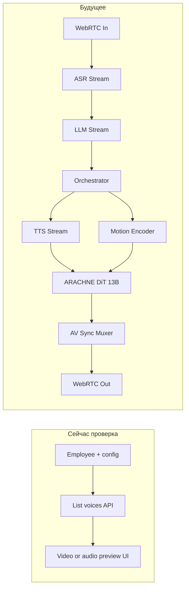

# Anam (видео-аватар) + пайплайн

Временная интеграция [Anam](https://anam.ai) для проверки **видео-аватара** и связки с существующей моделью **employee** в NULLXES VANTAGE. Код здесь не описывается — только цели, границы и этапы.

---

## Цели

1. Проверить **сквозной сценарий**: сотрудник → выбор голоса/персоны → **превью** (аудио/видео) без полной реализации ARACHNE/WebRTC out.
2. **Не хардкодить** голоса в UI (Alloy/Nova и т.д.) — брать список голосов из API Anam.
3. Сохранить **чёткую границу**: Anam = внешний провайдер «говорящей головы» / TTS; **employee** = источник промпта, capabilities и маршрутизации.

---

## API: list voices

Официальная справка: [list voices](https://anam.ai/docs/api-reference/list-voices).

- **Endpoint:** `GET https://api.anam.ai/v1/voices`
- **Auth:** Bearer (`Authorization: Bearer <API_KEY>`)
- **Полезное в ответе:** `id`, `displayName`, `provider`, `providerVoiceId`, `sampleUrl`, пагинация `page` / `perPage` / `search`.

Полный индекс документации Anam: [llms.txt](https://anam.ai/docs/llms.txt) — по нему искать разделы про **session**, **stream**, **avatar**, **WebRTC** (видео обычно идёт не через `list-voices`).

---

## Связь с `employee`

- В проекте уже есть сущность **employee** (`db/schema.ts`, JSONB `config`).
- Рекомендуемые поля в `config` (имена условные):
  - `anamVoiceId` — выбранный голос из list voices;
  - опционально `anamPersonaId` / session-related id, если появятся в API сессии аватара.
- Альтернатива: глобальный дефолт в **user_settings** (Arachne / AI defaults) + **override** на уровне конкретного employee.

---

## Видео-аватар vs только голос

| Слой | Что даёт `list-voices` | Что искать дальше в доках Anam |
|------|------------------------|--------------------------------|
| Голос / TTS | Выбор `voice id`, примеры через `sampleUrl` | — |
| Видео-аватар | Не напрямую | Endpoints **создания сессии**, **streaming URL**, **WebRTC** / SDK |

Практичный порядок внедрения:

1. **(A)** BFF: список голосов + выбор в UI → сохранение в `employee.config`.
2. **(B)** Один тестовый **видео/аудио-плеер** по URL или SDK из сессии Anam (после уточнения endpoint).
3. **(C)** Подключение к **оркестратору**: текст/аудио из вашего пайплайна → Anam как внешний рендерер лица.

---

## Пайплайн (текущая проверка vs будущее)

**Временный мост:**

- Оркестратор отдаёт текст/аудио в **Anam** как внешний «рендерер лица», пока **Motion Encoder + DiT** не готовы; или наоборот — только **TTS через Anam voices**, видео — статичный аватар.

**Граница ответственности:**

- **Anam** — демо/замена слоя говорящей головы/потока.
- **Employee** — промпт, capabilities, лимиты и бизнес-логика платформы.

---

## Безопасность и эксплуатация

- Ключ Anam только **на сервере** (например `ANAM_API_KEY` в env). UI не получает сырой ключ.
- В UI — только данные, уже прошедшие через BFF (список голосов, токены сессии если появятся).
- Кэш списка голосов на сервере (TTL), пагинация в UI — чтобы не бить API на каждый запрос.

---

## Открытые вопросы

1. Какой **конкретный endpoint** Anam отдаёт **video stream** / WebRTC для аватара (см. [llms.txt](https://anam.ai/docs/llms.txt)).
2. Нужна ли отдельная сущность **«сессия Anam»** в БД или достаточно ephemeral state в worker.
3. Совместимость выбранного **voice id** с будущей заменой на **внутренний TTS + ARACHNE** (миграция полей в `config`).

---

## Этапы внедрения (кратко)

| Этап | Содержание |
|------|------------|
| 1 | voices API → BFF → выбор в UI → `employee.config.anamVoiceId` |
| 2 | Превью (sample URL или сессия Anam) по доке |
| 3 | Включение в оркестратор (текст/аудио → Anam) |
| 4 | Полный WebRTC out после готовности **Mux / Sync** |

---

## Реализовано в коде (тестовый превью)

- **BFF:** `POST /api/anam/session` — [Create session token](https://anam.ai/docs/api-reference/create-session-token), ключ только на сервере (`ANAM_API_KEY`).
- **Клиент:** `@anam-ai/js-sdk` → `createClient(sessionToken)` → `streamToVideoElement` на странице сотрудника `/employees/[employeeId]`, если включён превью.
- **Включение UI превью:** **`ANAM_API_KEY`** обязателен. Либо **`ANAM_PERSONA_ID`** / `employee.config.anamPersonaId` → `personaConfig.personaId`, либо полный custom **`personaConfig`**: `name`, `avatarId`, `voiceId`, `llmId`, `systemPrompt`. Для сотрудников с именем MIRAZ/Mira (или тестовый id `emp_841e5c78cab04a01`) в коде зашиты дефолтные **avatar / voice / llm** и **system prompt** (Miraz Vantage); их можно переопределить env или `employee.config`. Шаблон: `env.anam.example`. См. [create session token](https://anam.ai/docs/api-reference/create-session-token), [list personas](https://anam.ai/docs/api-reference/list-personas).
- **Опционально:** `ANAM_SESSION_SEND_ENVIRONMENT=1` — добавить в JSON тело `environmentId` (для теста по умолчанию резолвится `41648ba8-b8b9-4e8f-a79c-982c6234fef7` из `employee.config.anamEnvironmentId` или `ANAM_ENVIRONMENT_ID`). В публичном OpenAPI поле не описано — при 400 от API отключите флаг.
- **Сеть:** если в логах `ECONNRESET` / TLS к `api.anam.ai` — VPN, прокси, фаервол или нестабильный канал; попробуйте другую сеть. Таймаут запроса к Anam: `ANAM_SESSION_FETCH_TIMEOUT_MS` (по умолчанию 25000).
- **Аудио (UI):** под превью — панель **Audio**: микрофон в Anam (`enumerateDevices` + `changeAudioInputDevice`), mute входа (`muteInputAudio` / `unmuteInputAudio`), громкость речи на `<video>`, выбор выхода через `setSinkId` (Chrome/Edge; иначе системный выход). Настройки микрофона/громкости/выхода кэшируются в `localStorage` (`dai_saas.anam.*`).
- **Переопределение:** в `employee.config`: **`anamPersonaId`** (предпочтительно) или legacy `anamAvatarId`, `anamVoiceId`, `anamLlmId`, `anamEnvironmentId` (`EmployeeConfigJson`).

---

*Документ зафиксирован для согласования архитектуры; обновлять по мере появления реальных endpoint’ов Anam для video session.*
